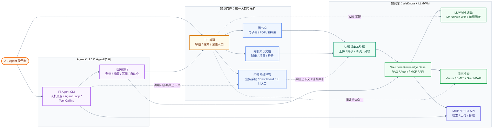

# Knowledge Aggregate Architecture

这份图用于构思一个个人或团队可用的知识聚合体：知识门户负责统一入口，WeKnora / LLMWiki 负责知识沉淀和检索，Pi Agent CLI 负责人、Agent 与知识之间的任务桥接。

## Architecture Map

## Component Roles

- **知识门户**：面向人提供统一导航、搜索入口和深链入口，把电子书、内部文档、内部系统托管入口组织成可浏览的知识地图。
- **WeKnora / LLMWiki 知识库**：把原始文档和系统上下文沉淀为可检索、可问答、可编译的知识资产，核心能力包括 RAG、混合检索、Wiki 编译、知识图谱、MCP 和 REST API。
- **Pi Agent CLI**：作为人和知识之间的执行桥梁，让用户用命令行或 Agent 工作流触发查询、摘要、写作、自动化和内部系统上下文调用。

## Relationship Notes

- 实线表示核心信息流：知识从门户收集到知识库，Agent 通过 MCP / API 使用知识库能力，再把任务结果回写到门户或知识库。
- 虚线表示辅助连接：门户可跳转到 Wiki 或问答入口，Pi Agent 可引用内部系统上下文，内部系统也可以被整理成链接索引。
- 这张图先服务构思和讨论，不包含部署拓扑、数据库选型、鉴权模型或完整 API 合约。

## Open Questions

- 权限模型：门户、知识库和 Agent CLI 是否共享同一套身份与权限？
- 同步机制：电子书、内部文档和系统链接是手动导入、定时同步，还是由 Agent 辅助整理？
- MCP / API 边界：Pi Agent 主要调用 WeKnora 的 MCP 工具，还是走 REST API / SDK？
- 门户深链：门户里的每个知识入口是否需要直接跳到 Wiki 页面、RAG 问答或原始系统？
- CLI 工作流：Pi Agent 更偏“临时问答助手”，还是要沉淀为可复用的项目级命令和技能包？
